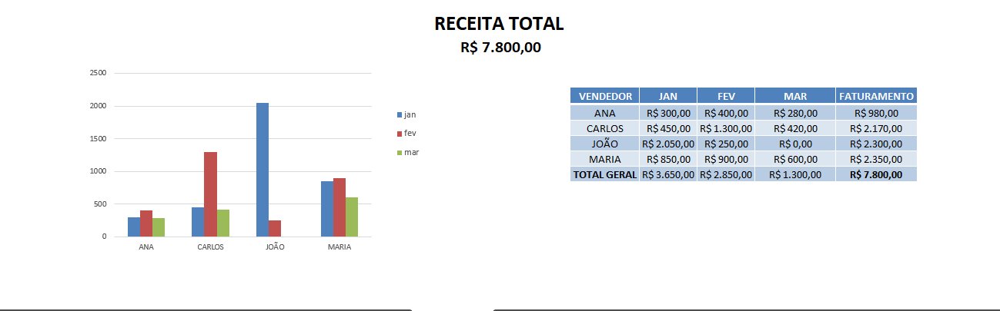

# 📊 Excel - Funções Essenciais para Análise de Dados

## 🎯 Objetivo

Demonstrar a aplicação prática de funções do Excel na análise de dados, com foco em automação e tomada de decisão.

## 💼 Contexto

Simulação de um cenário real de análise de vendas, onde é necessário avaliar o desempenho de vendedores e consolidar informações de forma automatizada.

## 🛠️ Solução

Foram utilizadas funções como:

* PROCV e PROCX → para busca de dados
* SOMASE → para consolidação de vendas
* Tabelas dinâmicas → para análise e visualização

## 📈 Resultado

* Identificação do faturamento por vendedor
* Visualização do total geral de vendas
* Dashboard com análise clara e objetiva

## 📊 Insight

O vendedor João apresentou o maior faturamento no período, indicando melhor desempenho comercial.

## 📸 Dashboard

## 📁 Arquivo

* excel-funcoes-essenciais.xlsx
